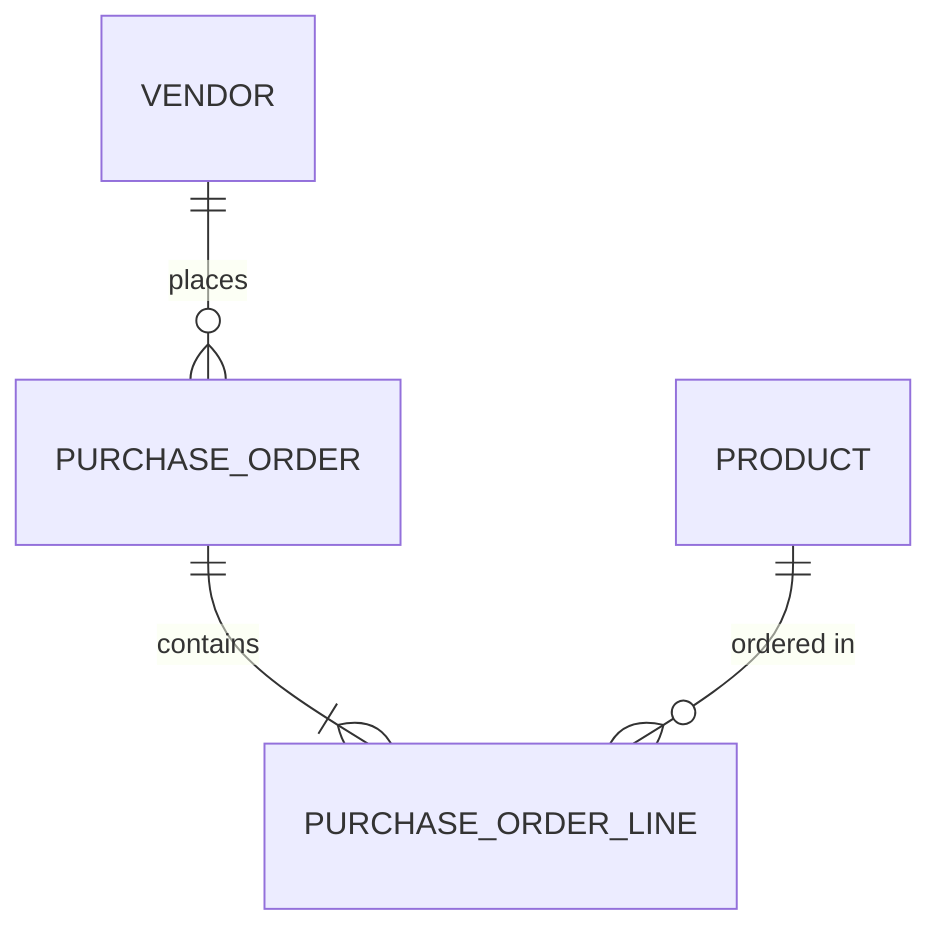

# Procurement API

A small backend for the procure-to-pay flow found in ERP systems such as Microsoft Dynamics 365 Finance & Operations. Built with C#, ASP.NET Core and SQL Server as a learning project.

## What it does

- Manage **vendors** and **products** (with stock levels)
- Create **purchase orders** with several lines for a vendor
- **Receive** an order, which adds the ordered quantities to product stock in a single database transaction
- Two SQL reports (stock on hand, open orders per vendor)

## Business rules

- An order needs an existing, active vendor and at least one line
- Every line needs an existing product and a quantity greater than zero
- Each line copies the product's price at order time, so later price changes don't alter old orders
- An order can only be received once; a second attempt returns 409 Conflict
- Receiving updates stock and order status together; if anything fails, both are rolled back
- SKUs are unique

## Data model



## Endpoints

| Method | Route | Purpose |
|---|---|---|
| GET / POST | /api/vendors | List / create vendors |
| GET | /api/vendors/{id} | Get one vendor |
| GET / POST | /api/products | List / create products |
| GET | /api/products/{id} | Get one product |
| GET / POST | /api/purchaseorders | List / create orders |
| GET | /api/purchaseorders/{id} | Get one order with its lines |
| POST | /api/purchaseorders/{id}/receive | Receive an order and update stock |

## Tech stack

C#, .NET 10, ASP.NET Core Web API, Entity Framework Core, SQL Server, xUnit (tests run on in-memory SQLite).

## Run it locally

Requirements: .NET 10 SDK, SQL Server Express.

```bash
dotnet ef database update --project Procurement.Api
dotnet run --project Procurement.Api
```

The connection string is in `Procurement.Api/appsettings.json` and uses Windows authentication against `localhost\SQLEXPRESS`.

Run the tests with:

```bash
dotnet test
```

## SQL reports

The `Sql` folder contains two queries: `stock_on_hand.sql` and `open_orders_per_vendor.sql`. The second uses LEFT JOINs so vendors without open orders still appear.

## Possible next steps

- Approval step and roles for purchase orders
- Audit log of changes
- Authentication
- Deployment to Azure